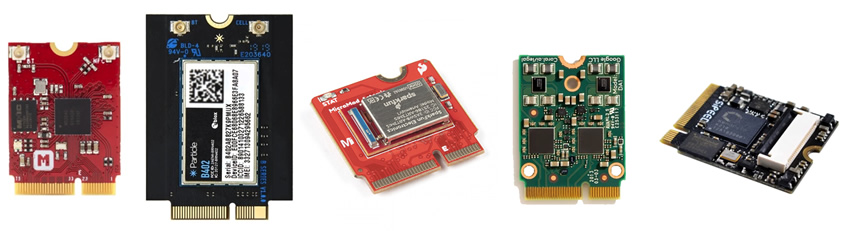
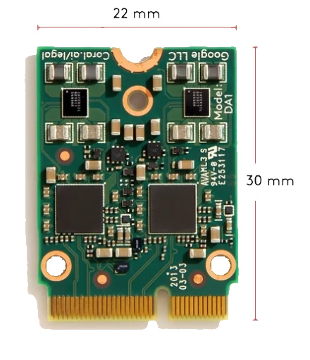
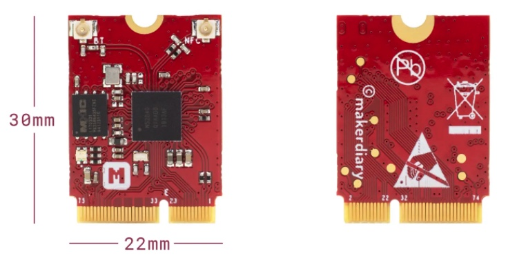
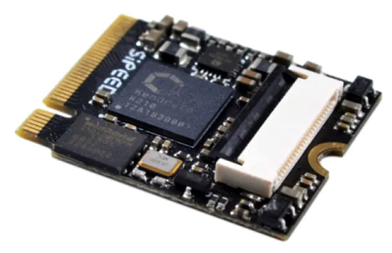
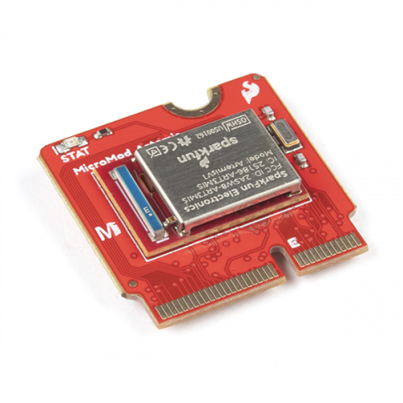
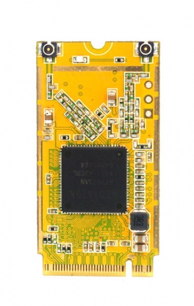

# M.2

This repo, wiki, and issues/[discussions](https://github.com/adafruit/M.2/issues/2) are a collection of the current implementations of M.2 form factor for use as microcontrollers and modules started from a [Twitter discussion](https://twitter.com/zs/status/1319691639586082816).

**What is M.2?**

> M.2, formerly known as the Next Generation Form Factor (NGFF), is a specification for internally mounted computer expansion cards and associated connectors. M.2 replaces the mSATA standard, which uses the PCI Express Mini Card physical card layout and connectors. Employing a more flexible physical specification, the M.2 allows different module widths and lengths, and, paired with the availability of more advanced interfacing features, makes the M.2 more suitable than mSATA in general for solid-state storage applications, and particularly in smaller devices such as ultrabooks and tablets - [Wikipedia](https://en.wikipedia.org/wiki/M.2).

## M.2 Processor modules (not Wi-Fi / cellular accessory cards)
- [Google](#Google)
- [makerdiary](#makerdiary)
- [Particle](#Particle)
- [Sipeed](#Sipeed)
- [SparkFun](#SparkFun)
- [WRTnode](#WRTnode)

makerdiary, Particle, and SparkFun boards do not appear to be compatible at this time (see pinouts, links, and datasheets).

If a board is missing, release date incorrect, etc. email: <m2@adafruit.com> / or open an issue / pull request.

## Google

M.2 Accelerator with Dual Edge TPU, M.2 E-key form factor - [product page](https://coral.ai/products/m2-accelerator-dual-edgetpu), [datasheet & documentation](https://coral.ai/docs/m2-dual-edgetpu/datasheet/). 

Release date: [September 19, 2020](https://developers.googleblog.com/2020/09/doubling-down-on-edge-with-corals-new.html).

## makerdiary

nRF52840 M.2 Module, M.2 E-key form factor - [product page](https://makerdiary.com/collections/prototyping/products/nrf52840-m2-module), [datasheet & documentation](https://wiki.makerdiary.com/nrf52840-m2/). 

Release date: [July 11, 2020](https://github.com/makerdiary/nrf52840-m2/blob/master/README.md).

makerdiary, [Particle](https://twitter.com/Chris_Gammell/status/1319695770505875456) and SparkFun MicroMod [do not appear](https://twitter.com/bitshiftmask/status/1319695270569967616) to be compatible - [comparison](https://docs.google.com/spreadsheets/d/1Z9QjP8fAvubUfc8ZP4rFAF2qbMxP0rMNrEVA8LHFWLg/edit#gid=0).

## Particle

B Series LTE CAT-M1 - [product page](https://store.particle.io/products/b-series-lte-som), [datasheet & documentation](https://docs.particle.io/b-series/).

Release date: [October 19, 2020](https://github.com/particle-iot/som-eval-board).

makerdiary, [Particle](https://twitter.com/Chris_Gammell/status/1319695770505875456) and SparkFun MicroMod [do not appear](https://twitter.com/bitshiftmask/status/1319695270569967616) to be compatible - [comparison](https://docs.google.com/spreadsheets/d/1Z9QjP8fAvubUfc8ZP4rFAF2qbMxP0rMNrEVA8LHFWLg/edit#gid=0).

## Sipeed

K210 Edge Neural Network Accelerator - [product page](https://www.seeedstudio.com/Sipeed-M1n-Module-AI-Development-Kit-based-on-K210-p-4491.html), [datasheet & documentation, none found](https://www.hackster.io/news/sipeed-brings-kendryte-s-k210-edge-neural-network-accelerator-to-pcie-m-2-usb-type-c-with-maix-nano-89aa85ef32c0).

Release date: February 2020.

## SparkFun

MicroMod - [product page](https://www.sparkfun.com/micromod), [datasheet & documentation](https://www.sparkfun.com/micromod#tech-specs).

Release date: [October 21, 2020](https://www.sparkfun.com/news/3419).

makerdiary, [Particle](https://twitter.com/Chris_Gammell/status/1319695770505875456) and SparkFun MicroMod [do not appear](https://twitter.com/bitshiftmask/status/1319695270569967616) to be compatible - [comparison](https://docs.google.com/spreadsheets/d/1Z9QjP8fAvubUfc8ZP4rFAF2qbMxP0rMNrEVA8LHFWLg/edit#gid=0).

## WRTnode

WRTnode2P - Devboard - [product page](http://wrtnode.com/w/?p=727), [DFRobot](https://www.dfrobot.com/product-1541.html), [datasheet & documentation](http://wrtnode.com/w/?p=727).

Release date: 2017.

